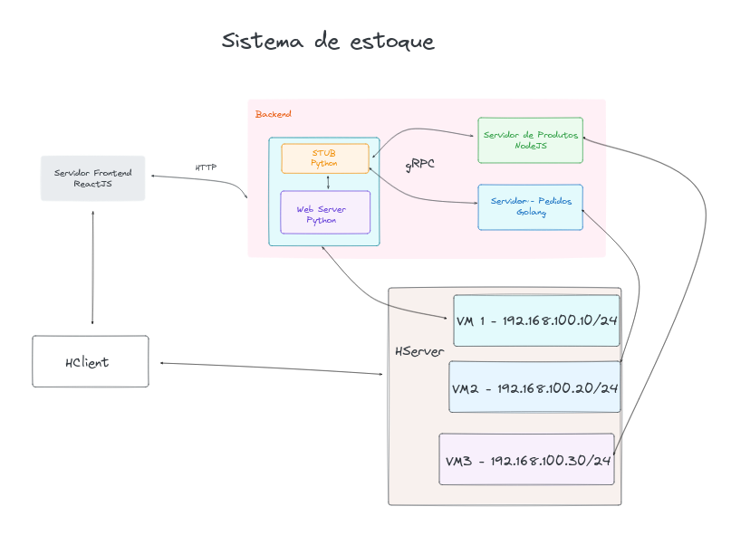

# Atividade extraclasse
- Laboratório de Virtualização e gRPC 

## Disciplina
- Programação para Sistemas Paralelos e Distribuídos (Turma: 01)

## Equipe

| Nome completo                     | Matrícula | Usuário do GitHub                                    |
| :-------------------------------- | :-------: | :--------------------------------------------------- |
| Rodolfo Cabral Neves              | 180011472 | [@roddas](https://github.com/roddas)                 |
| Cainã Valença de Freitas          | 180014412 | [@freitasc](https://github.com/freitasc)             |
| Lucas Gabriel Sousa Camargo Paiva | 190112123 | [@lucasgabriel-2](https://github.com/lucasgabriel-2) |
| Lucas de Lima Spinosa dos Santos  | 180022512 | [@LucasLimaSpinosa](https://github.com/LucasLimaSpinosa) |
| Alex Gabriel Alves Faustino       | 200056602 | [@Gabriel-axl](https://github.com/Gabriel-axl)       | 

## Histórico de contribuição

| Nome completo                     | Matrícula | Feature                                                    | Linguagem de programação / Tecnologia                          | Usuário do GitHub                                        |
| :-------------------------------- | :-------: | :--------------------------------------------------------- | :------------------------------------------------------------- | :------------------------------------------------------- |
| Rodolfo Cabral Neves              | 180011472 | Servidor gRPC que cria e lista os produtos                 | NodeJS                                                         | [@roddas](https://github.com/roddas)                     |
| Cainã Valença de Freitas          | 180014412 | Servidor gRPC que cria e lista os pedidos                  | Golang                                                         | [@freitasc](https://github.com/freitasc)                 |
| Lucas Gabriel Sousa Camargo Paiva | 190112123 | Web Server, gRPC Stub e conexão do mesmo com os servidores | Python                                                         | [@lucasgabriel-2](https://github.com/lucasgabriel-2)     |
| Lucas de Lima Spinosa dos Santos  | 180022512 | FrontEnd da aplicação                                      | React                                                          | [@LucasLimaSpinosa](https://github.com/LucasLimaSpinosa) |
| Alex Gabriel Alves Faustino       | 200056603 | Virtualização, criação de redes e VMs                      | QEMU, KVM, libvirt, virsh, virt-manager, netplan, bridge-utils | [@Gabriel-axl](https://github.com/Gabriel-axl)           |

## Arquitetura da aplicação

 Figura 1 - Arquitetura da aplicação.

## Executando a aplicação

Para executar a aplicação siga as informações contidas em cada um dos READMEs nessa ordem, observe o diagrama de arquitetura representado na Figura 1 para visualizar onde cada serviço deve ser inicializado:

1) [Inicie a infraestrutura com virtualização para suportar essa aplicação](./vms/readme.md)
2) [Inicie o servidor gRPC de produtos](./server_product_manager/readme.md)
3) [Inicie o servidor gRPC de pedidos](./server_order_manager/readme.md)
4) [Inicie o gateway (web server e o stub gRPC)](./gateway/readme.md)
5) [Inicie o frontend](./frontend/readme.md)

## Apresentação

[Link para gravação no YouTube](https://youtu.be/E1mQyen6FoQ)